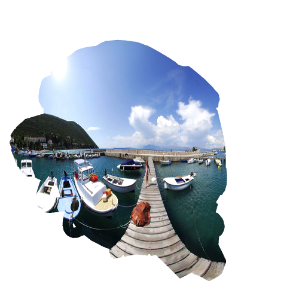

# texture 纹理

纹理是一种特殊的图片，它被映射到 3D 物体的表面，用来在不增加 3D 模型复杂性的情况下，增加物体的细节和视觉复杂性。

## 公共属性

| 属性名                | 描述                                      | 类型      | 默认值 |
| --------------------- | ----------------------------------------- | --------- | ------ |
| **has-alpha**         | 是否包含透明通道                          | `Boolean` | -      |
| **level**             | 纹理强度                                  | `Number`  | -      |
| **coordinates-index** | 纹理坐标索引                              | `Number`  | -      |
| **coordinates-mode**  | 纹理坐标模式(**只用于模拟物体表面反射!**) | `Number`  | -      |
| **wrap-u**            | 纹理水平包裹模式                          | `Number`  | -      |
| **wrap-v**            | 纹理垂直包裹模式                          | `Number`  | -      |

### coordinates-index

`coordinates-index` 是一个整数，用来指定纹理坐标的索引。如果你的模型有多个纹理坐标，你可以通过这个属性来指定使用哪个纹理坐标。

### coordinates-mode

`coordinates-mode` 是一个整数，用来指定模拟物体表面 **反射** 时的纹理坐标模式。它有以下几种取值：

| 枚举值 | 描述                                                                                                                                                                                                          |
| :----: | ------------------------------------------------------------------------------------------------------------------------------------------------------------------------------------------------------------- |
|  `0`   | EXPLICIT_MODE，显式指定，即使用物体本身的纹理坐标。                                                                                                                                                           |
|  `1`   | SPHERICAL_MODE，球形纹理，UV 被映射到一个球体上。                                                                                                                                                             |
|  `2`   | PLANAR_MODE，平面纹理，UV 被映射到一个平面上。                                                                                                                                                                |
|  `3`   | CUBIC_MODE，立方体纹理，UV 被映射到一个立方体上。                                                                                                                                                             |
|  `4`   | PROJECTION_MODE，投影纹理，UV 被映射到一个平面上，然后再投影到物体上。                                                                                                                                        |
|  `5`   | SKYBOX_MODE，天空盒纹理，UV 被映射到一个天空盒上。                                                                                                                                                            |
|  `6`   | INVCUBIC_MODE，反向立方体纹理，UV 被映射到一个立方体的内部。                                                                                                                                                  |
|  `7`   | EQUIRECTANGULAR_MODE，等角投影纹理，UV 被映射到一个球体上，创建出一种全景的效果。这种模式通常用于处理全景图像，例如 360 度的全景照片或视频。                                                                  |
|  `8`   | FIXED_EQUIRECTANGULAR_MODE，固定的等角投影纹理，UV 被映射到一个球体上。这种模式与 "等角投影纹理" 类似，但它固定了纹理坐标的映射，使得纹理在旋转物体时保持不变。这种模式通常用于创建环境映射，例如反射和折射。 |
|  `9`   | FIXED_EQUIRECTANGULAR_MIRRORED_MODE，镜像的固定等角投影纹理，UV 被映射到一个镜像的球体上。这种模式通常用于创建镜像的环境映射。                                                                                |

> 关于 `coordinates-mode` 的更多详细信息，参考 Babylon.js 文档：[纹理坐标模式](https://doc.babylonjs.com/features/featuresDeepDive/materials/using/reflectionTexture#coordinate-modes)

各种纹理坐标模式的效果如下：

| 枚举 |                                 效果                                  |
| :--: | :-------------------------------------------------------------------: |
| `0`  |                        |
| `1`  |                       |
| `2`  |                          |
| `3`  |                           |
| `4`  |                      |
| `5`  |                          |
| `6`  |                        |
| `7`  |                 |
| `8`  |           |
| `9`  |  |

### wrap-u 和 wrap-v

`wrap-u` 和 `wrap-v` 是整数，用来指定纹理的水平和垂直包裹模式。它们有以下几种取值：

| 枚举值 | 描述                                                                                                                            |
| :----: | ------------------------------------------------------------------------------------------------------------------------------- |
|  `0`   | 重复，即纹理会重复出现在物体表面，例如，一个纹理只有 1/4 的面积会被显示，但是这 1/4 的纹理会重复出现 4 次，以填充整个物体表面。 |
|  `1`   | 夹取，即纹理会被夹取到物体表面，超出物体表面的部分会被裁剪掉，不会显示。                                                        |
|  `2`   | 镜像重复，即纹理会重复出现在物体表面，但是每次重复都会进行镜像翻转。                                                            |
